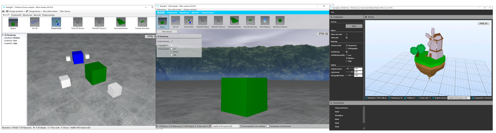
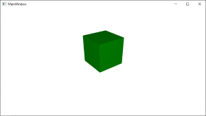

# SeeingSharp2
### Screenshots


### Common information
Seeing# is a 3D/2D rendering library for C# powered by Direct3D 11. It is meant for desktop applications (Win.Forms, Wpf) or Windows Store Apps.
The base library is separated into the following projects:
 - SeeingSharp (.Net Standard 2.0)
 - SeeingSharp.Uwp (Universal Windows)
 - SeeingSharp.Wpf (.Net Framework 4.8)
 - SeeingSharp.WpfCore (.Net Core 3.0)
 - SeeingSharp.WinForms (.Net Framework 4.8)
 - SeeingSharp.WinFormsCore (.Net Core 3.0)
 
The first one is the core library which contains all logic for 2D/3D-rendering. The others contain classes to integrate SeeingSharp into 
the particular gui framework. 
 
### Quick feature overview
 - Support .Net Core (.Net Standard 2.0) and the classic .Net Framework
 - Full integration into Windows.Forms, WPF and WinRT
 - Heavy multithreading (all calculations and rendering is done in background threads)
 - Working with multiple graphics devices at once (dynamically configure the target device per view)
 - Working with multiple scenegraphs at once (dynamically configure the current scene per view)
 - Flexible postprocessing mechanism
 - Support for software rendering using WARP technology
 - Integration of Direct2D directly into the 3D render process
 - Build custom 3D models by code
 - Import external 3D models 
 - And much more..

# Initial setup (WPF)
To give SeeingSharp 2 a short try you can do the following steps:

1. Download Nuget package (SeeingSharp.WpfCore oder SeeingSharp.Wpf, depending on your target framework
2. Include bootstrap code into your App.xaml.cs

```csharp
public partial class App : Application
{
    protected override void OnStartup(StartupEventArgs e)
    {
        GraphicsCore.Loader
            .SupportWpf()
            .Load();

        base.OnStartup(e);
    }
}
```
3. Add a view to your MainWindow.xaml
```xml
<Window x:Class="Testing.Simple3DApp.MainWindow"
        xmlns="http://schemas.microsoft.com/winfx/2006/xaml/presentation"
        xmlns:x="http://schemas.microsoft.com/winfx/2006/xaml"
        xmlns:d="http://schemas.microsoft.com/expression/blend/2008"
        xmlns:mc="http://schemas.openxmlformats.org/markup-compatibility/2006"
        xmlns:ssharp="http://www.rolandk.de/seeingsharp"
        mc:Ignorable="d"
        Title="MainWindow" Height="450" Width="800">
    <Grid>
        <ssharp:SeeingSharpRendererElement x:Name="CtrlView3D" />
    </Grid>
</Window>
```
4. Create a simple scene in code behind
```csharp
public partial class MainWindow : Window
{
    public MainWindow()
    {
        InitializeComponent();

        this.Loaded += OnMainWindow_Loaded;
    }

    private async void OnMainWindow_Loaded(object sender, RoutedEventArgs e)
    {
        // Build the scene
        var scene = this.CtrlView3D.Scene;
        await scene.ManipulateSceneAsync(manipulator =>
        {
            // Create material resource
            var resMaterial = manipulator.AddStandardMaterialResource();
            var resGeometry = manipulator.AddResource(
                device => new GeometryResource(new CubeGeometryFactory()));

            // Create the mesh and animate it
            var mesh = new Mesh(resGeometry, resMaterial);
            mesh.Position = new Vector3(0f, 1f, 0f);
            mesh.Color = Color4.GreenColor;
            mesh.BuildAnimationSequence()
                .RotateEulerAnglesTo(new Vector3(0f, EngineMath.RAD_180DEG, 0f), TimeSpan.FromSeconds(2.0))
                .WaitFinished()
                .RotateEulerAnglesTo(new Vector3(0f, EngineMath.RAD_360DEG, 0f), TimeSpan.FromSeconds(2.0))
                .WaitFinished()
                .CallAction(() => mesh.RotationEuler = Vector3.Zero)
                .ApplyAndRewind();
            manipulator.AddObject(mesh);
        });

        // Configure camera
        var camera = this.CtrlView3D.Camera;
        camera.Position = new Vector3(3f, 3f, 3f);
        camera.Target = new Vector3(0f, 0.5f, 0f);
        camera.UpdateCamera();

        // Append camera behavior (this enables simple input / movement)
        this.CtrlView3D.RenderLoop.SceneComponents.Add(new FreeMovingCameraComponent());
    }
}
```
5. Here it is...

