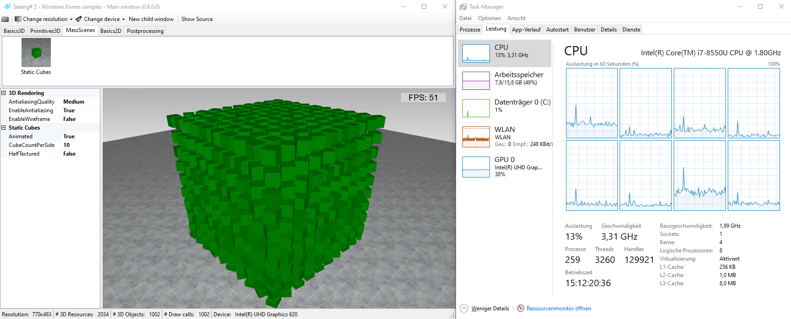
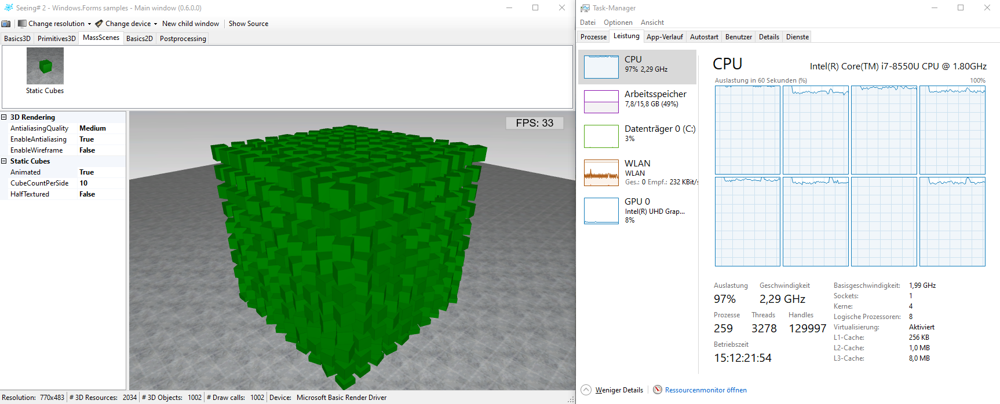

## Overview
SeeingSharp 2 supports rendering also on a software device. That means, all rendering is done on CPU. This may be slow, but still is a good fallback solution on environments where you do not have a real hardware device (e. g. some virtualized servers). [WARP](https://docs.microsoft.com/en-us/windows/win32/direct3darticles/directx-warp) is used by SeeingSharp for software rendering under the hood. One very important question behind this technology is how it consumes CPU resources when activated. Therefore, I do a short and simple comparision here.

## Hardware rendering
First, look at the following screenshot where I am using a hardware device. It is a Intel adapter on my Ultrabook, so clearly not the fastest on the world. Still, you see on this example that the CPU has little to do during rendering.

## Software rendering
Now look at the following screenshot where I am using the software device on the same machine (just a few minutes later). It uses WARP as mentioned above. The CPU utilization is at maximum! But... the PC still reacts normaly on user input. So, it is not as evil as it seems on first sight. WARP seems to run on lower thread priority (may... in fact I am no expert to WARP internals)

## Conclusion
For me, software rendering is a good fallback solution on environments where you do not have hardware acceleration. If you use it, you should be careful with the required CPU resources. In my usage scenarios this was never a real problem so far. The only thing is: If the machine is managed by someone else, you should give them a note. There are some monitoring tools out there which post a warning or error on such constantly high CPU utilization.

WARP is also a good technology for automated testing. Most of the unittests of SeeingSharp are running on the software device. This allows them to run on all machines which support SeeingSharp independent of the hardware.