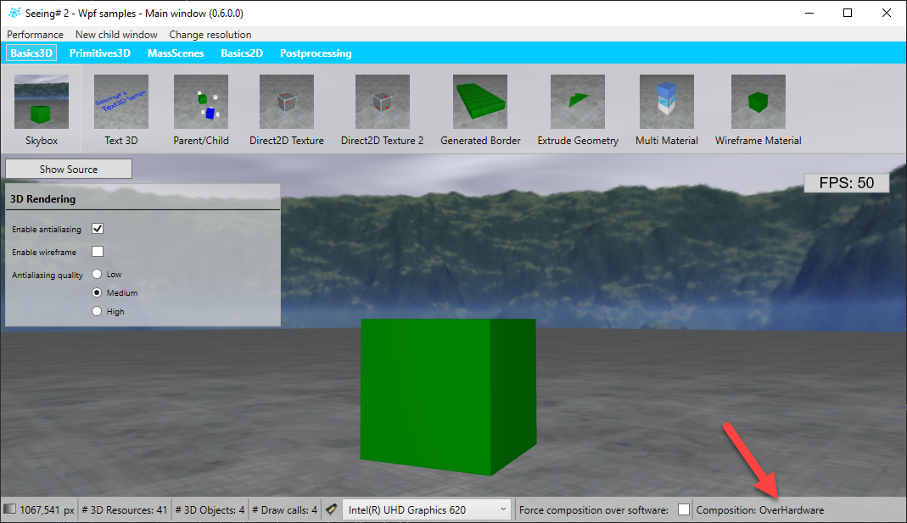

[Home](../../README.md)

When you are using SeeingSharp 2 on WPF, then you may have noticed the CompositionMode property on the SeeingSharpRenderElement class. You also see the value of this property in the WpfSampleContainer like in the following screenshot. It can take one of the values OverHardware, FallbackOverSoftware or None. It is a very important property because it describes how SeeingSharp posts rendering results into the WPF rendering chain. For short, these values have the following meaning:

 - **OverHardware**: SeeingSharp uses the most direct way to post its own rendering results to WPF. [WPF and Direct3D9 interop](https://docs.microsoft.com/en-us/dotnet/framework/wpf/advanced/wpf-and-direct3d9-interoperation) is used here under the hood. 
 - **FallbackOverSoftware**: This is a slower approach which is triggered, when "OverHardware" is not possible. One case is, when you don't have a rendering hardware (-> Software based rendering). Another case is, when SeeingSharp uses another graphics adapter as WPF. There may be some other cases, but I think the mentioned two are the most common ones. But... what happens here exactly? SeeingSharp creates a WriteableBitmap and copies rendering results into it after each frame. Sounds slow and in fact it is (surprisingly faster as one may think). This is the reason why it's called "Fallback" - this mode should be avoided when possible. Nevertheless, there may be cases where this CompositionMode is normal like on virtualized servers without emulated graphics hardware.
 - **None**: No rendering at all - SeeingSharp may not be initialized correctly.

